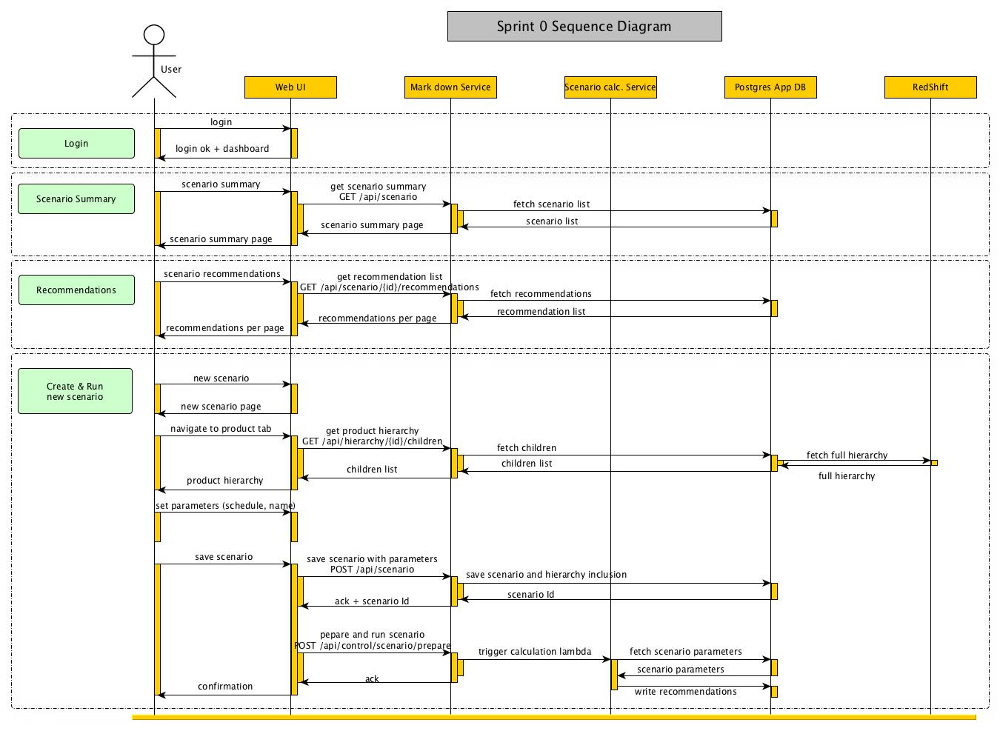

# Sprint 0
## Demo Path
  * Login using pre-defined static username and password
  * Land on a dashboard
  * Navigate to a scenario summary page and be able to see scenario statuses
  * Navigate to a scenario creation page, be able to select part of the product hierarchy to run the scenario against, as well as a schedule and scenario name
  * Be able to run a created scenario
  * Be able to run 2 scenario in parallel
  * Be able to drill into price recommendations for a completed scenario run 

## Architecture

## Sequence Diagram

