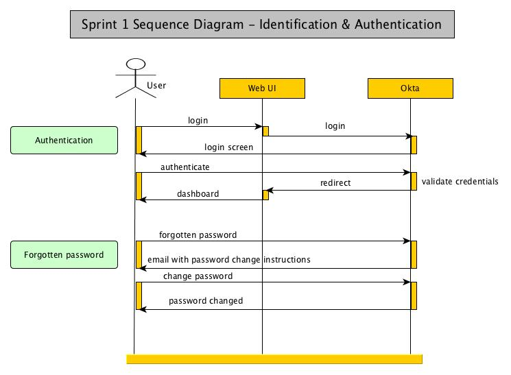
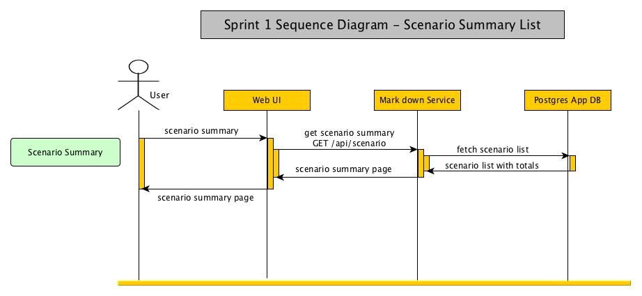
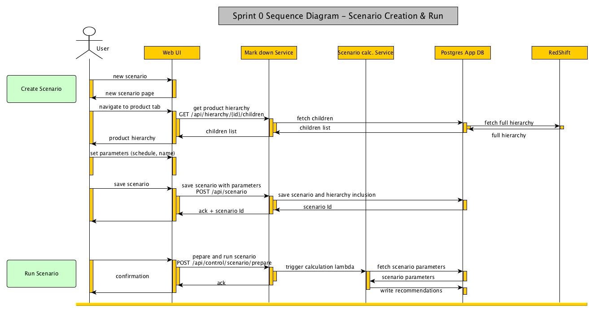
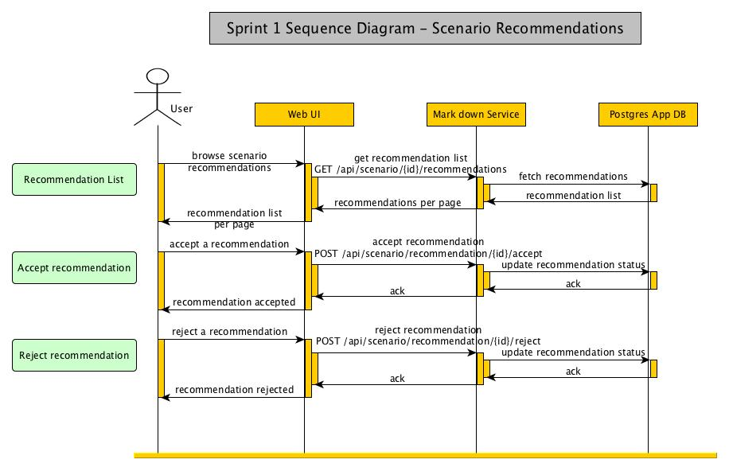
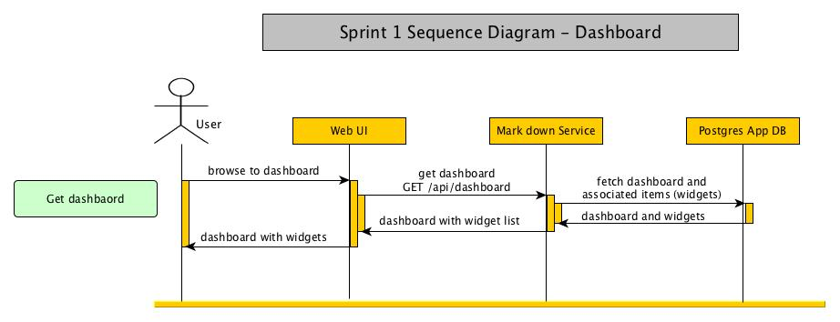
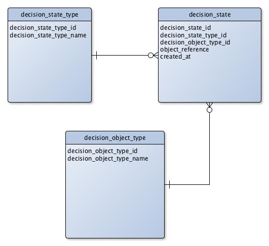
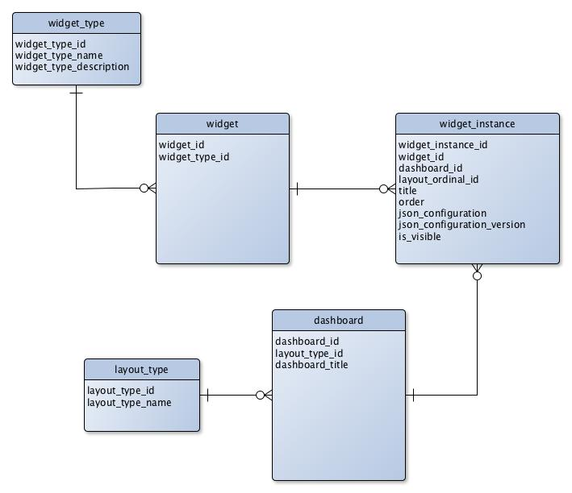

# Sprint 1
## Demo Path
* I try to log in but forgot my password
* I ask for a password reset
* I receive a password reset email and follow the reset flow
* I log in with my new password
* I see a scenario summary widget on my dashboard
* I click on a completed scenario and arrive on the workspace where I can see recommendations for the selected scenario
* On the workspace I do some simple sorting and filtering on the grid
* I accept some of the recommendations and reject some others
* I demonstrate auto-deployment and creation of a new environment on the fly
* I demonstrate some data loading from S3 to Redshift

## High Level Architecture
No architecture changes are anticipated for Sprint 1


## Sequence Diagrams
### Identification & Authentication
Sprint 1 will add the forgotten password functionality


### Scenario List
Sprint 1 will add the UI functionality to calculate totals, this will be needed to display financial information based on recommendation acceptance/reject.


### Scenario Calculation
No changes for Sprint 1


### Recommendation Accept/Reject
Sprint 1 will add a functionality to allow the user to accept or reject specific recommendations (revise is not in scope for this sprint)


### Dashboard
Sprint 1 introduces the notion of dashboard and widgets.


## Description of change
### Recommendations accept/reject
#### REST API
we will add the 2 following method:

* POST /api/scenario/{scenarioGuid}/recommendation/{recommendationGuid}/accept
* POST /api/scenario/{scenarioGuid}/recommendation/{recommendationGuid}/reject
  
#### REST Data Model
New fields will need to be added to the VmRecommendation and VmScenario models (as per comment in bold below). We will also replace scenario and recommendation Ids by Guids, which will also be used a query key to GET /api/scenario/{scenarioGuid} and GET/api/scenario/{scenarioGuid}/recommendations
  
```
  VmRecommendation {
    recommendationId (integer), --> will be change to recommendationGuid (string)
    scenarioGuid (string), --> new field
    scenarioId (integer),
    hierarchyName (string),
    productId (integer),
    productName (string),
    originalSellingPrice (number),
    currentSellingPrice (number),
    sellThroughTarget (number),
    terminalStock (integer),
    pricePathPrices (string), --> will be removed to the benefit of projections**
    totalRevenue (number),
    status (enum), --> new field
    projections (array<VmProjection>), --> new field
    markdownCost (number) --> new field
  }
  VmProjection {
    price (decimal),
    discount (decimal),
    quantity (decimal)
  }
  VmScenario {
    scenarioId (integer),
    scenarioGuid (string), --> new field
    week (integer),
    scheduleWeekMin (integer),
    scheduleWeekMax (integer),
    scheduleStageMin (integer),
    scheduleStageMax (integer),
    stageMax (integer),
    stageOffsetMax (integer), 
    priceFloor (number),
    customerId (integer),
    scenarioName (string),
    scheduleMask (integer),
    lastRunDate (string),
    status (string),
    totalProducts (integer),
    totalRecommendations (integer),
    totalRevenue (decimal), --> new field
    totalMarkdownCost (decimal) --> new field
  }
```
  
#### DB Data Model
We will introduce the tables below to track an audit of decision state for each recommendation.



#### Scenario Calculation Outcome
Each recommendation will have to show the following data:

* Total Markdown cost (revenue opportunity loss from the markdowns)
* For each week of the scenario (Named MD Depth in the ticket)
 * Retail price and % markdown (even if no markdown has happened)
 * Sale volume
* Sale Through Target
* Total sale volume
* Remaining stock

On the scenario summary page we will need to show the following summary information:

* Total revenue
* Total Markdown cost
* Those summary information will be impacted by recommendation being accepted and rejected:
* When a recommendation is accepted, the recommendation data need to be used

When a recommendation is rejected, the original data (without markdown) will need to be used
### Widget
#### REST API
GET /api/dashboard/
#### REST Data Model
/api/dashboard/

```
VmDashboard {
 id (integer)
 Title (string)
 Layout (enum=GridLayout)
 List[VmDashboardItem] {
   Id (integer)
   DashboardId (integer)
   Type (enum=Accordian)
   Title (string)
   Order (integer)
   Json (string)
   JsonVersion (string)
   IsVisible (boolean)
 }
}
```

#### DB Data Model

### Filtering / Sorting
Q: Do we cover pagination at the same time?

A:Yes, but as a nice to have, not committed for this sprint
#### REST API
GET requests to handle additional parameters for sorting and filtering
Query Format

```
GET /api/scenario?status=in:RUNNING,COMPLETE
GET /api/scenario?numberproduct=gt:10000
GET /api/scenario?sort=name,status:desc,numberproduct
GET /api/scenario?sort=name,status:desc,numberproduct&numberproduct=gt:500&numberproduct=lt:10000
GET /api/scenario?sort=name,status:desc,numberproduct&filter=numberproduct:gt:500,numberproduct=lt:10000
```

for more details: <https://specs.openstack.org/openstack/api-wg/guidelines/pagination_filter_sort.htm>
### Reset Password
On the UI only at this stage
### Data Load / ETL
Pushed to Sprint 2
### Auto-Deployment
Pushed to Sprint 2
### SFTP Support
SFTP support will be explored during Sprint 1 and we will aim to have a workable solution by the end of the sprint.

The solution retain is a long lived micro EC2 instance hosting the SSH deamon, and mounting a S3 bucket to store uploaded files. This will allow us to meet our flexibility and cost requirements.
### Product Hierarchy
A little painful at the moment, how do we solve it? on UI or on back-end? do we simply wait for the filtering functionality to come up?

We will do a quick investigation to see if the current storeproc can be easily modified
Outcome: the change started but review and testing has been pushed to Sprint 2