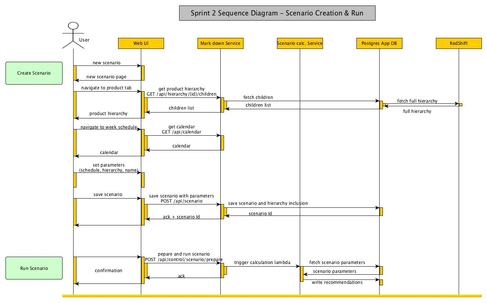
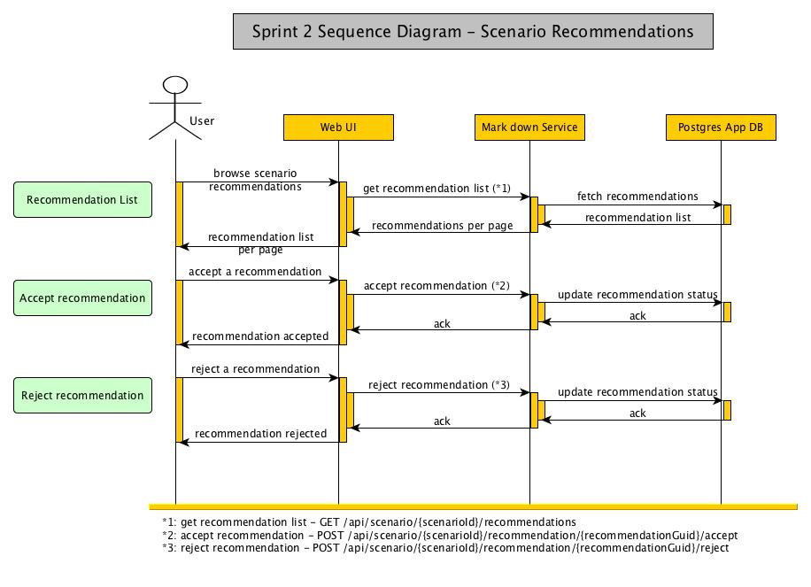
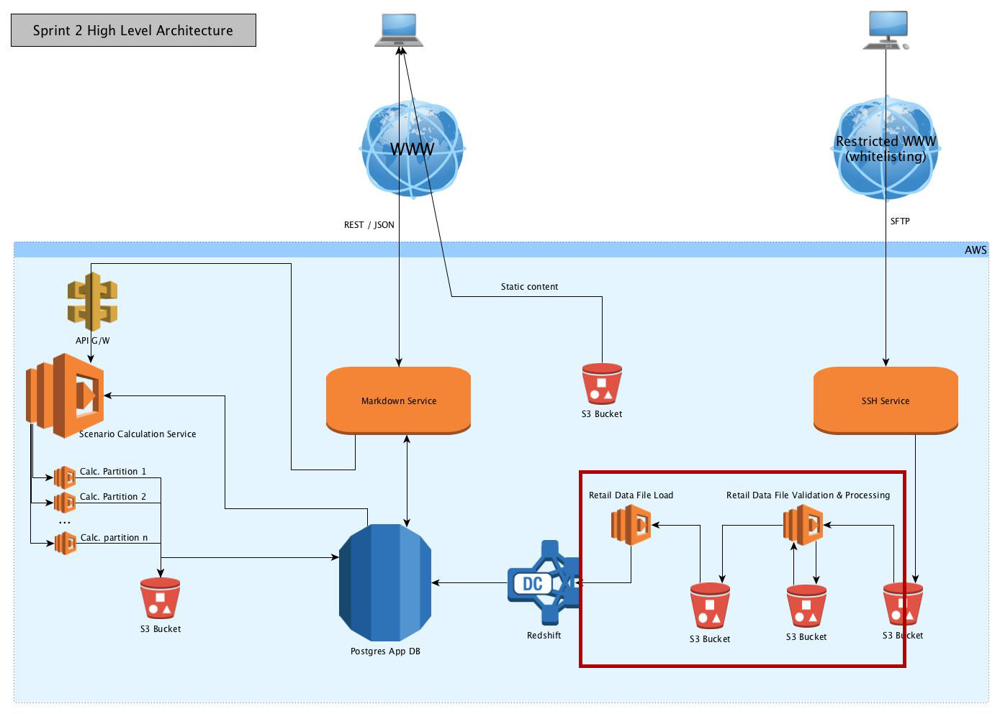
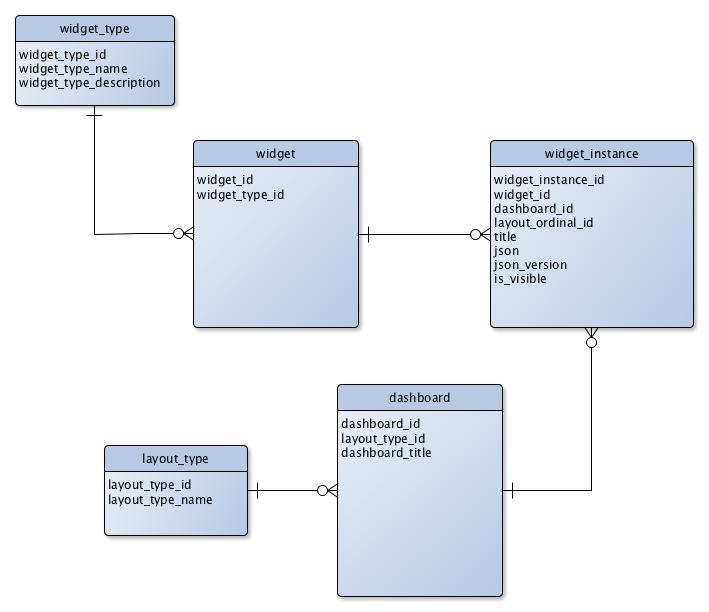

# Sprint 2
##High Level Architecture
Sprint 2 will make use of the SFTP support introduced in Sprint 1, as well as introduce the ETL process for load of retail data files.


##Sequence Diagrams
A new calendar functionality is introduced in the scenario creation flow.



The Scenario Recommendation sequence diagram does not change, but the API endpoint URLs do change to replace scenarioGuid with scenarioId.



##Description of change
###Retail Data Loading
Sprint 2 will concentrate on establishing the architecture for the retail data file load through our ETL process. In this sprint we will only support the load of the product definition file.

####ETL Process Overview
The file to load will land in a S3 bucket upon upload by the customer using our SFTP server.

A 'Validation and Processing' lambda function gets triggered by file landing in the bucket and performs the following operations:

* Move the file into a staging bucket
* Unzip the file
* Sort the file
* Perform some basic validation (full validation not in scope for this sprint)
* Browse both the file and existing redshift table to identify new and changed records
* Write a new record insert file for all new records and changed records
* Write a soft delete file for existing records
* Kick off the Load lambda function

The 'Load' lambda function is used for the following:

* Load soft delete file and update redshift records
* Load insert file and insert redshift records

Control and monitoring of the ETL process is a stretch goal for this sprint.

Using lambda functions will introduce some time and memory limitation to our process; however we have already identified few options for when these limits are reached and we're therefore comfortable going down that architecture. In later sprints we will have to continue building on that process to address its limits, possibly by splitting the files early on to spread to load work.

####Standard Data Format
The standard file format has been defined (although future changes are to be anticipated) and can be found here: [ETL Mappings](https://deloitteproducts.deloitteanalytics.co.uk/wiki/display/MAR/ETL+Mappings)

####Architecture Change
The overall architecture will be impacted by this new ETL process (scope of change highlighted by the red box below).



###Ability to run Markdown for future events
We want to provide customers with the ability to run markdown for weeks occurring in the future. For that we need to fine tune our extrapolation method.

####REST API
No changes

####Overall Architecture changes
No changes

####DB Model
None: currently hardcoded

###Filtering / Sorting / Paging
Sprint 2 will concentrate on finishing the filtering, sorting and pagination for the scenario list and scenario detail pages.

We will change the scenario list and scenario detail API calls to introduce a number of new pagination parameters, as well as changing the view model to return information needed for pagination.

Filtering and sorting will use the parameter definition introduced in [Sprint 1](002.sprint_1.MD)

####REST API

Paging parameters will be introduced:

* pageLimit --> representing the number of items per page, 50 being the default value
* pageIndex --> representing the page number to return, 1 being the first page

Example:

```
  GET /api/scenario/?pageLimit=50&pageIndex=3
```

####REST Data Model
We will introduce the new field below (in bold):

```
  VmPage[Object] {
    pageIndex (integer),
    pageSize (integer),
    totalItemCount (integer),
    <b>totalPageCount (integer),</b>
    items (Array[Object])
  }
```

####DB Model
No DB change

####Filtering operand

| Operation	| Operand	   | Comment   |
|------------|------------|-----------|
| Equals	| eq	| Pushed to next sprint |
| Not Equals	| neq	| Pushed to next sprint |
| Greater Than	| gt	| Delivered |
| Less Than	| lt	| Delivered |
| Greater or Equal	| ge	| Pushed to next sprint |
| Less or Equal	| le	| Pushed to next sprint |
| In	| in (with comma separated values, ex: 'product=in:ab,c,d') | Pushed to next sprint |
| Not In	| in	| Pushed to next sprint |
| Contains	| inc	| Pushed to next sprint |
| Does not contain	| ninc	| Pushed to next sprint |
| Blank (Null) and empty string |	 null	| Pushed to next sprint |
| Starts with	| sw	| Pushed to next sprint |
| Ends with	| ew	| Pushed to next sprint |

###Select Week in Scope for Scenario
We'll need the ability of handling bespoke customer calendar to allow them to choose their scenario period more effectively.

For this sprint we are planning to hardcode a default calendar, which will be mapped onto the standard UK calendar. Later on, we can introduce more calendars for different customers.

####REST API
a new REST endpoint will be introduced

```
  GET /api/calendar
```

URL parameters will be:

```
  startDate (long) --> timestamp in seconds, default will be interpreted as current date
  numberWeeks (integer) --> default 8
```

The response will be:

```
  VmCalendar {
    calendarId (integer),
    calendarName (string),
    startDate (long), --> timestamp in seconds
    numberWeeks (integer),
    weeks [
      weekNumber (integer),
      weekStart (long), --> timestamp in seconds
      dayWeekStart (integer) --> [1 -> Monday, 7-> Sunday]
    ]
  }
```

###Better Reporting of Scenario Statuses
We are not currently able to trulls identify the state of a running scenario, for example the scenario doesn't appear as running before the preparation steps finish. For this reason we want to refactor the code to always be able to identify the exact status of a scenario run.

####REST API
ScenarioGuid will be abandoned and replaced with ScenarioId, both on the endpoint URL and in the View Model.

Endpoint impacted:

```
  POST /api/scenario/{scenarioId}/recommendations/
  POST /api/scenario/{scenarioId}/recommendation/...
```

####REST Data Model

```
  VmScenario {    
    scenarioId (integer),
    <b>scenarioGuid (string), --> to be removed</b>
    week (integer),
    scheduleWeekMin (integer),
    scheduleWeekMax (integer),
    scheduleStageMin (integer),
    scheduleStageMax (integer),
    stageMax (integer),
    stageOffsetMax (integer), 
    priceFloor (number),
    customerId (integer),
    scenarioName (string),
    scheduleMask (integer),
    lastRunDate (string),
    status (string),
    totalProducts (integer),
    totalRecommendations (integer),
    totalRevenue (decimal),
    totalMarkdownCost (decimal)
  }
```

###Widget Refactoring
####REST API
The rest API is changing to match the definition below.

```
/api/dashboard/

VmDashboard {
  DashboardId (integer)
  DashboardTitle (string)
  LayoutTypeId (integer)
  LayoutTypeName (string)
  List[VmDashboardWidget] {
    WidgetId (integer)
    WidgetInstanceId (integer)
    DashboardId (integer)
    WidgetType (enum=Accordian)
    Title (string)
    Order (integer)
    Json (string)
    JsonVersion (int)
    IsVisible (boolean)
  }
}
```

####DB Model
The underlying database model is documented below.



###Product Hierarchy Selection – To be pushed to Sprint 3
####REST API
####REST Data Model

_add child count and leaf flag_

####DB Model

_store proc_


