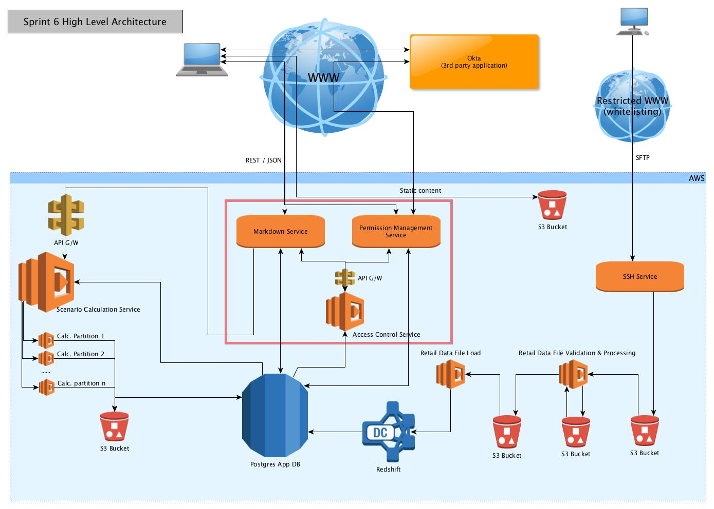
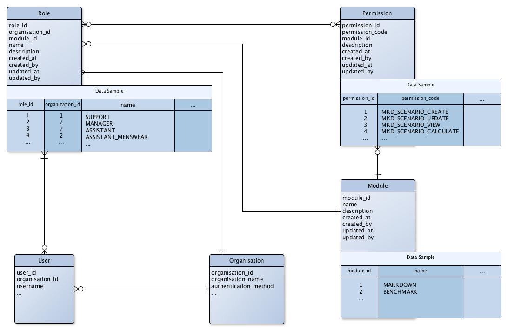

#Application Security Model - Step 1

**DISCLAIMER:** This document does not address network security, which will be covered separately.

##Security Levels
###Functionality Level (scope of this document)
This level restrict what application functionality a user is able to perform, for example: Creating a scenario, Viewing the scenario list, Running a scenario, Creating a new User, etc...

###Entity Level (will be covered in [Step 2](007.security_model_design_2.MD))
This level is a row level permissioning, it defines which entity (row) a user can or cannot see. For example user A might be able to view the scenario list, but only for scenario belonging to his/her organisation.

###Field Level (not in scope yet)
This level is a column level permissioning, it defines which fields within an entity a user can or cannot see. For example user A might be able to view all scenario for his/her organisation, but cannot see the markdown cost for these scenario.

##Underlying Architecture Model

2 new services will be added to the architecture.

###New Access Control Service
A new service, implemented as a lambda function, will be introduced to control functionality and data access.

The View and Repository layers of all services will call this service -respectively for functionality access and for data access - passing an identity token and organization id*.

This service will in turn query the outsourced authentication provider (most likely Azure B2B), as well as the application database to verify permission and retrieve an entity filter (allowing us to filter at an entity level).

Actual management of these permissions will not be the responsibility of this Access Control Service but will be delegated to the Permission Management Service.

_* The organization Id could be inferred from the user identity but we want to ensure the multi-tenant aspect of our application is being kept in mind throughout all functionality flows_

####REST API
This new service will implement the following REST API:

End points: 

```
POST /api/accesscontrol/validate
```

Parameters:

```
/api/accesscontrol/validate
	JWT Token
```

Response Model (for both end points):

```
  VmUser {
    Token (string),
    Permissions (array<<o>string>),
    Role (string),
    UserId (integer),
    OrganizationID (integer),
    Username (string),
    Firstname (string),
    Lastname (string),
    [...]
  }
```

###Permission Management Service
A new Permission Management Service, implemented as a fat EC2 service (as current Markdown service), will be introduce to manage organizations, users, roles, permissions and entity filters.

This will be a simple CRUD service for permission management. Like any other service, it will need the call the Access Control Service to manage its permission restriction.

####REST API
Endpoints for this service will be:

```
/api/user/[...]
/api/organization/[...]
/api/role/[...]
/api/permission/[...]
```

###Updated High Level Architecture



##Access Control Sequence Diagram


##Underlying Database Model
###New Tables
New tables will need to be created to support the security model and allow for a user interface to be built on top of it.



##Performance Impact
This model will obvisouly introduce potential performance issues as the Access Control service is being called numerous time. This issue can be resolved with caching should we need to; however we are not addressing it in this initial implementation.

We will perform performance testing to identify if and where improvements need to be made on the software architecture as a whole.

##Implementation Suggestion within Application Layers
###REST / View Layer
####Verify Authentication

The view layer will be responsible for verifying the passed user token and retrieving the user identity, alongside its permissions.

For this reason, every REST endpoint will now require a JWT token to be passed.

We'll have to implement a bespoke user authentication mechanism implementing the IUserStore interface (similar to a database driven authentication), which will call the Access Control Service providing the Token and OrganizationID, and retrieve a fully formed User entity.

#####Reference

<https://stackoverflow.com/questions/24296613/web-api-token-authentication-with-a-custom-user-database>

<https://stackoverflow.com/questions/20529401/how-to-customize-authentication-to-my-own-set-of-tables-in-asp-net-web-api-2>


####Verifying Authorization

The view layer will also be responsible for authorizing each user, enforcing a check on the user permission.

#####Code Sample

**DISCLAIMER:** The code samples below are only provided to illustrate the proposed changes, they are not means to be a exact implementation. The developer(s) will be responsible to implementing it in the way they think best fit; however we will require an implementation which: 

 * allows for easy modification as our security model will evolve (potentially towards ABAC)
 * is relatively transparent to each controller implementation 
 * is enforceable


In your controller, define authorization requirements for each REST action your expose:

```
[HttpPost("scenario/calculate")]
[Authorize(Policy = "RequirePermissionMkdScenarioCalculate")]
public async Task Calculate(VmControlCalculate model)
{
   [...]
}
```

In startup.cs, define each new policy your are using:

```
public void ConfigureServices(IServiceCollection services)
{
 
  services.AddAuthorization(options =>
  {
      [...]
      options.AddPolicy("RequireScenarioCalculatePermission",
         policy => policy.Requirements.Add(new PermissionRequirement("MKD_SCENARIO_CALCULATE")));   // we would most likely use an enum
      options.AddPolicy("RequireScenarioViewPermission",                         
      	  policy => policy.Requirements.Add(new PermissionRequirement("MKD_SCENARIO_VIEW")));
      [...]
  });
  
  services.AddSingleton<<d>IAuthorizationHandler, PermissionHandler>();
}
```

We will need to create a permission requirement and permission handler class:

```
public class PermissionRequirement: IPermissionRequirement
{
    public PermissionRequirement(string permission)   // we would most likely use an enum
    {
        Permission = permission;
    }
 
    Public string Permission { get; set; }
}

public class PermissionHandler : AuthorizationHandler<PermissionRequirement>
{
    protected override Task HandleRequirementAsync(AuthorizationHandlerContext context, PermissionRequirement requirement)
    {
        if (context.User.Permissions.Contains(requirement.Permission))
        {
            context.Succeed(requirement);
        }
        return Task.CompletedTask;
    }
}
```


####Reference

<https://docs.microsoft.com/en-us/aspnet/core/security/authorization/claims>

<https://stormpath.com/blog/tutorial-policy-based-authorization-asp-net-core>


##Implementation Steps

We would suggest the following implementation steps:

1. Create a new 'Access Control Service'
 * Validate the JWT token with Okta and return pass / fail
 * Implement the underlying database layer
 * Read from hardcoded DB values to retrieve users and permissions
 * Return user and permission list
2. Amend the Markdown Service to call the Access Control Service to validate token and permissions

##Appendix
###Initial Data Set
####Functionality Permission List

We will define the following hardcoded permissions on application installation. The list will need to increase as the application evolves.

| Permission Code | 
|:------|:------|
| MKD\_SCENARIO_CREATE | |
| MKD\_SCENARIO_CALCULATE | |
| MKD\_SCENARIO_UPLOAD | |
| MKD\_SCENARIO_PREPARE | |
| MKD\_SCENARIO_VIEW | |
| MKD\_SCENARIO_UPDATE | |
| MKD\_SCENARIO_DELETE | |
| MKD\_MODEL_BUILD | |
| MKD\_ORGANIZATION_CREATE | |
| MKD\_ORGANIZATION_VIEW | |
| MKD\_ORGANIZATION_UPDATE | |
| MKD\_ORGANIZATION_DELETE | |
| MKD\_USER_CREATE | |
| MKD\_USER_VIEW | |
| MKD\_USER_UPDATE | |
| MKD\_USER_DELETE | |
| MKD\_ROLE_CREATE | |
| MKD\_ROLE_VIEW | |
| MKD\_ROLE_UPDATE | |
| MKD\_ROLE_DELETE | |
| MKD\_PERMISSION_VIEW | |
| MKD\_ENTITY_VIEW | |
| MKD\_ENTITY\_FILTER_CREATE | |
| MKD\_ENTITY\_FILTER_VIEW | |
| MKD\_ENTITY\_FILTER_UPDATE | |
| MKD\_ENTITY\_FILTER_DELETE | |

####Organization

We will define the following hardcoded organization on application installation:

| ID | Organization | Comment |
|:---|:---|:---|
| 1 | Deloitte | Organization supporting the super administrator role |

####Roles

We will define the following hardcoded role on application installation:

| Role | Organization_ID | Comment |
|:---|:---|:---|
| MARKDOWN\_SUPER_ADMINISTRATOR | 1 | Top level role with every permission |

####Modules

We will define the following hardcoded module on application installation:

| Module | Organization_ID | Comment |
|:---|:---|:---|
| MARKDOWN | 1 | Markdown module |


####Users

We will define the following hardcoded user on application installation (could be a config parameter as well):

| Username | Organization_ID | Role | Comment |
|:---|:---|:---|:---|
| mkdadmin@deloitte.co.uk | 1 | MARKDOWN\_SUPER_ADMINISTRATOR | Top level user |

We will hardcode this role name within the access control service to always authorize the action, and to have no entity level restriction. This will prevent potential mistake in locking out the application when removing permission from top level user.
