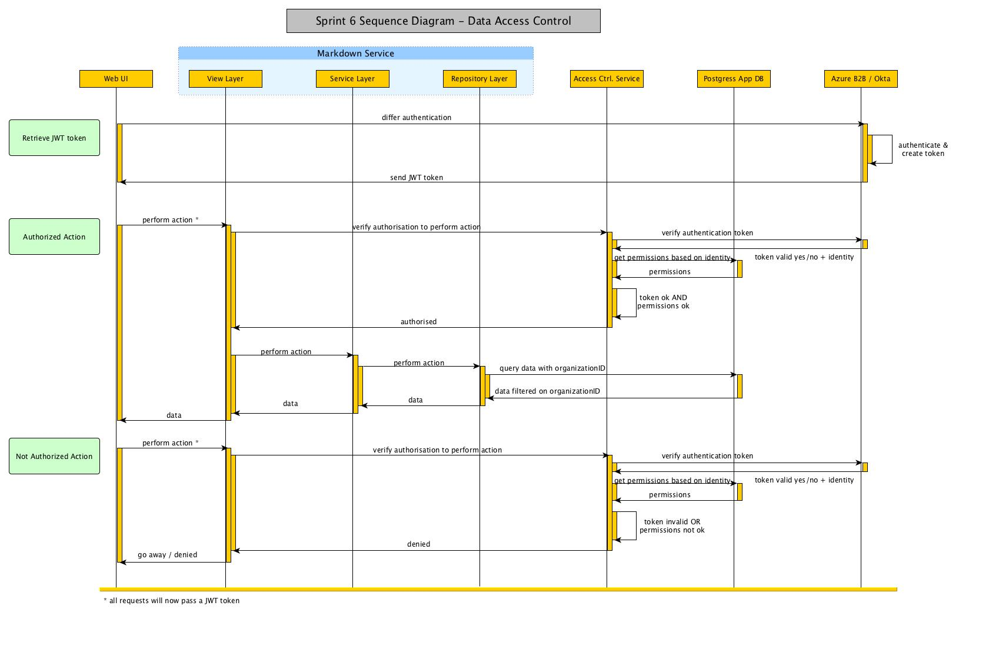

#Application Security Model - Step 2

**DISCLAIMER:** This document does not address network security, which will be covered separately.

##Security Levels
###Functionality Level (covered in [Step 1](006.security_model_design.MD))
This level restrict what application functionality a user is able to perform, for example: Creating a scenario, Viewing the scenario list, Running a scenario, Creating a new User, etc...

###Entity Level (scope of this document)
This level is a row level permissioning, it defines which entity (row) a user can or cannot see. Users will only be able to see data belonging to their organization.

###Filtering

Further refinement on row level filtering (filtering based on other parameters than OrganizationId), as well as column level filtering, will be covered separately. This will be the subject of a filtering functionality.

##Underlying Architecture Model

No changes required for this second step

##Access Control Sequence Diagram

The only change on the sequence diagram is the new UserId query parameter passed to the database for data filtering.



##Underlying Database Model

###Modifying Existing Tables
We will also need to modify existing tables to add the following fields:

* OrganizationId
* Created By
* Created At
* Updated By
* Updated At

###View Modification
Some views (or stored procedures) will need to be created to allow filtering based on OrganizationID:

* ScenarioView
* RecommendationView
* HierarchyView
* OrganizationView
* UserView
* RoleView

Each view/proc should:

* accept a OrganizationID input parameter, identifying the current logged in user
* only return data which have been created for the same organization as the current organization id (passed in parameter).


##Implementation Suggestion within Application Layers

###Data Filtering

The repository layer will need to change to:

* pass the OrganizationID to the views/stored procedures as a query parameter
* set OrganizationID and UserId for auditing fields (OrganizationID, CreatedBy, UpdatedBy)

####Code Sample

**DISCLAIMER:** The code samples below are only provided to illustrate the proposed changes, they are not means to be a exact implementation. The developer(s) will be responsible to implementing it in the way they think best fit; however we will require an implementation which: 

 * allows for easy modification as our security model will evolve
 * is relatively transparent to each repository implementation 
 * is enforceable


The context code (IMarkdownEfContext) will change to apply the data filtering query when accessing the DbSet.

* DbSet to change to IQueryable (or expose IQueryable in the getter)
* Enrich each IQueryable getter to:
 * require an Identity object as a parameter (We suggest the identity object to contain information such as the token, userId and organisationId)
 * pass on a OrganizationID to the database query

The repository code would change to retrieve an already filtered query.

It will change from:

```
        public async Task<QueryResults<ScenarioSummary>> GetAll(IList<IFilter> filters, int pageIndex, int pageSize)
        {
            var query = Context.ScenarioSummaries
                .Include(x => x.Scenario)
                .AsQueryable();
                
            if (filters.Any())
                query = Filter(query, _filterMap, filters);
                
            var items = await query
                .Select(t => t)
                .Skip((pageIndex - 1) * pageSize)
                .Take(pageSize)
                .ToListAsync();
                
            var total = query.Count();
            return new QueryResults<ScenarioSummary>
			{
                Items = items,
				PageIndex = pageIndex,
				PageSize = pageSize,
                Total = total
			};
        }
```

To: 

```
public async Task<QueryResults<ScenarioSummary>> GetAll(<font style="background-color: #fff772">IIdentityObject identityObject, </font>List<IFilter> filters, int pageIndex, int pageSize)
        {
            var query = Context.GetScenarioSummaries(identityObject)    // enforce application of data filters within context
                .Include(x => x.Scenario)
                .AsQueryable();
                
            if (filters.Any())
                query = Filter(query, _filterMap, filters);
                
            var items = await query
                .Select(t => t)
                .Skip((pageIndex - 1) * pageSize)
                .Take(pageSize)
                .ToListAsync();

			var total = query.Count();

            return new QueryResults<ScenarioSummary>
			{
                Items = items,
				PageIndex = pageIndex,
				PageSize = pageSize,
                Total = total
			};
        }
```


####Reference

<https://docs.microsoft.com/en-us/aspnet/core/security/authorization/claims>

<https://stormpath.com/blog/tutorial-policy-based-authorization-asp-net-core>

