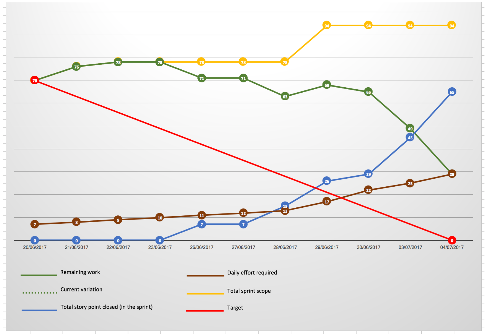

# Sprint 4 Progress Tracking
## Demo Path

* I access the application and see a landing message on the dashboard
* I create a scenario and run it by clicking on the run button
* I create another scenario and run it directly from the creation screen
* I go into the scenario workspace
* On the workspace I can see totals for my scenario
* I accept and reject recommendation, which impacts the totals
* I click on 'accept all' and all recommendations become accepted
* I can change the content to Bulgarian (is the number/date formatting impacted?)

## Technical Design

[Sprint 4 Technical Design](../tech/01.design/008.sprint_4.MD)

## Sprint Demo Presentation

[Sprint 4 Demo presentation](./resources/Sprint_4_demo.pptx)

## Burndown

## Retrospective

### Improvements

* Our ability to have handled last minute requests
* Feel like the technical backbone is starting to be in place and that we start to actually deliver new functionalities
* We moved tickets from lane to lane faster, especially at code review stage

### To be improved

* It would be useful to have a sprint roadmap
* We need better requirements and better acceptance criteria
* We need to have more discussions between Dev and QA
* Would be useful to have a view on server load
* QA estimates are not factored well enough in the story points
* We still need to make our tickets smaller
* We need the abilty to run the application locally

### Actions for next sprint

* We will enforce a discussion between Dev and QA prior to development start on any ticket
* QA will get access to AWS to be able to visualize server load
* Sanj/Richard will work on building the sprint roadmap